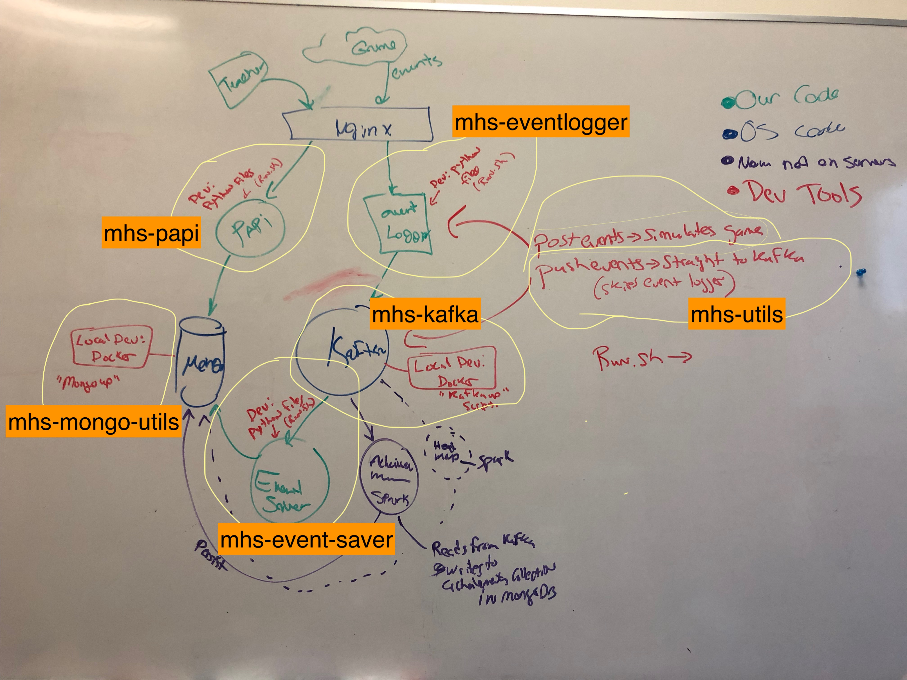

# Servers
*There will also be missouri.edu domain resolutions for these IPS*
mhs-dev.sociallycompute.io has address 204.185.83.14 *dev*
mhs.sociallycompute.io has address 204.185.83.15 *production*
mhs-sand.sociallycompute.io 204.185.83.16 *sandbox*

# How the servers and the various parts below are working together is illustrated here in this diagram:

# Code
## EventLogger
https://github.com/Mission-Hydro-Sci/mhs-eventlogger.git
Appears to be up to date in GitHub

## EventSaver
https://github.com/Mission-Hydro-Sci/mhs-event-saver.git

## Kafka Configuration
https://github.com/Mission-Hyrdo-Sci/mhs-kafka.git
This is used to start and stop the Kafka server we use.

## MHS Test Utilities
https://github.com/Mission-Hydro-Sci/mhs-utils.git
... Nabil notes that the follow two scripts are the main things to look at here:
1. **pushevents.py: Sends test data to the Kafka server** See "mhs-utils" GitHub Repository
2. **postevents.py: Sends test data to the event logger** See "mhs-utils" GitHub Repository

## MHS Analytics Website
To visit the site:  http://mhs-dev.sociallycompute.io/teachers
You have to go to the subdirectory of teachers to see a list of the teachers right now. As shown above.

GitHub Repository: https://github.com/Mission-Hydro-Sci/mhs-papi.git
